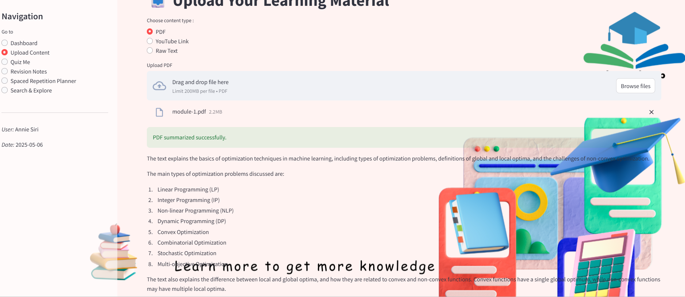
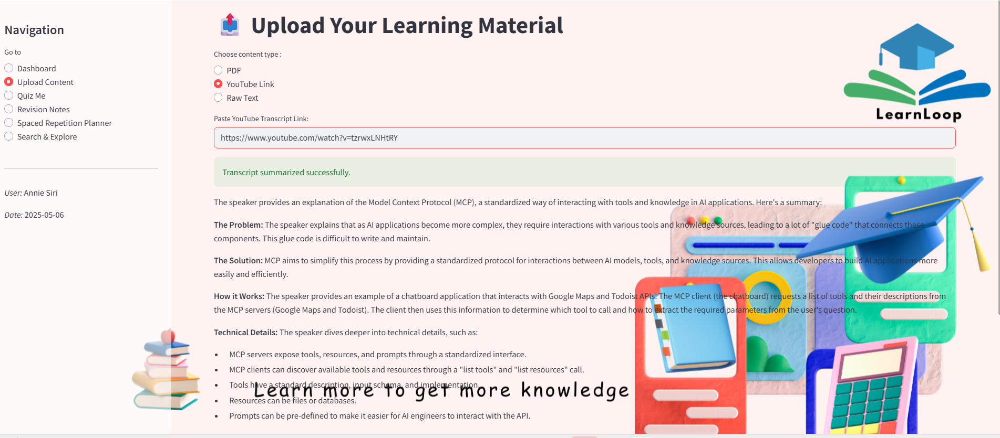
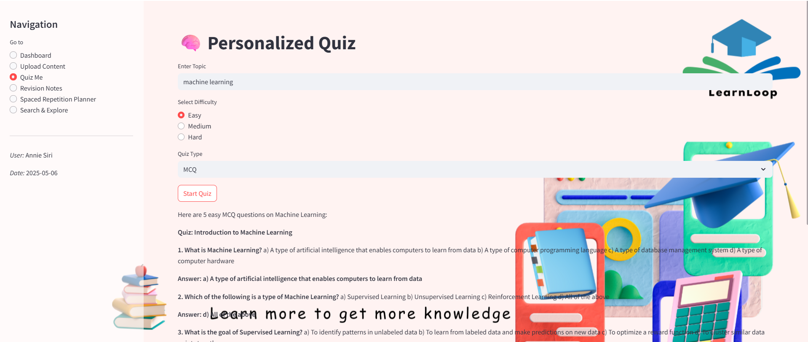
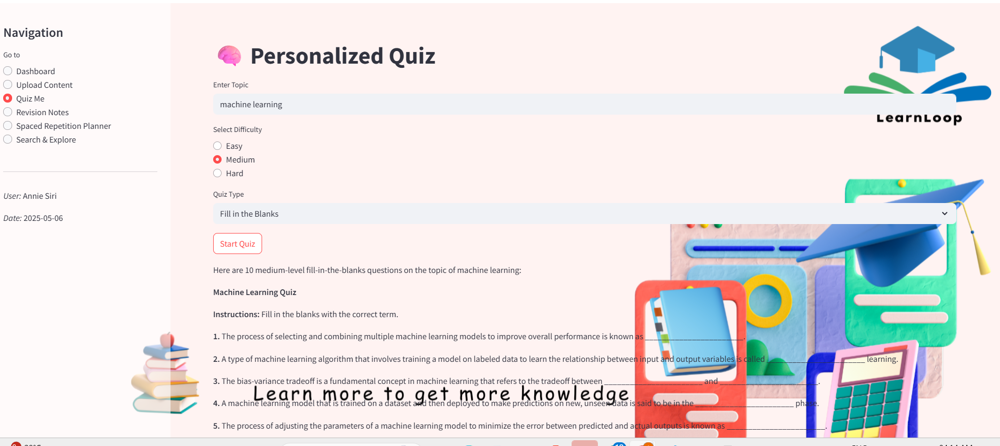
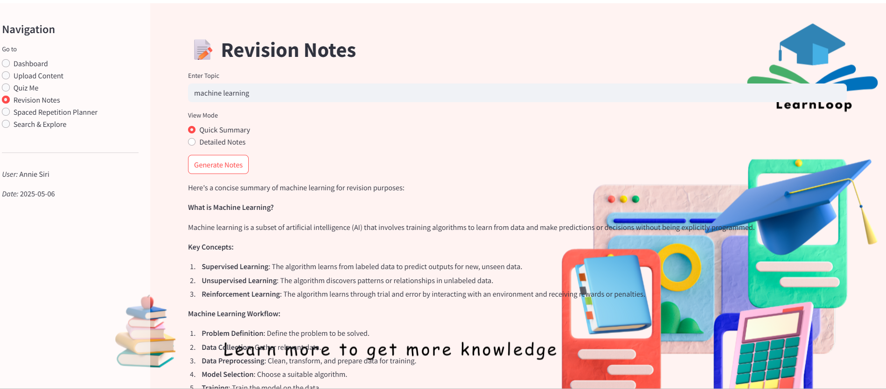
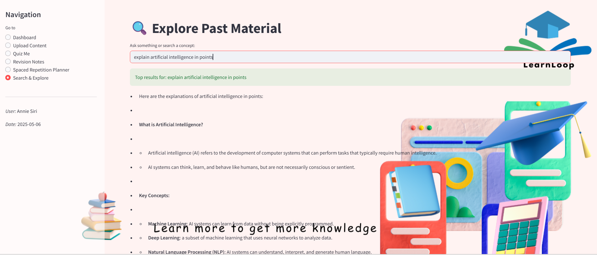
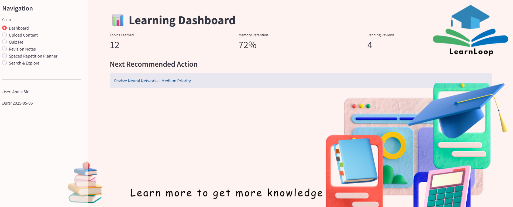

# 📚 Personal Learning Assistant GenAI

An AI-powered interactive learning platform that helps students learn smarter by summarizing YouTube videos, PDFs, and raw text, generating adaptive quizzes and revision notes, and planning spaced repetition-based revisions.
## 📸 Project Screenshots

   
   
   
   

   
   
   

## 📹 Demo Video
[Download Video](assests/demo video.mp4)

🚀 Key Features
🔹 📥 Multi-Format Input & Smart Summarization
→ Upload YouTube links, PDF documents, or raw text
→ AI summarizes key concepts using advanced LLMs

🔹 🧠 Personalized Quiz Generator
→ Auto-generates MCQs, Fill-in-the-Blanks, and Short Answers
→ Adapts difficulty (Easy, Medium, Hard) based on content depth

🔹 📝 AI-Powered Revision Notes
→ Instant generation of short summaries or detailed notes
→ Supports PDF download for offline access

🔹 ⏰ Spaced Repetition Scheduler
→ Tracks learning timelines and retention
→ Recommends optimal revision time using memory decay algorithms

🔹 🔍 Semantic Search Engine
→ Search learned concepts using embeddings
→ Returns similar topics even if phrased differently

🔹 🤖 AI Assistant Panel
→ Chat-like in-app support for summarizing, explaining, or reviewing content
→ Available throughout the learning experience
---

## 🧠 Tech Stack

| Layer                  | Technologies Used                                |
| ---------------------- | ------------------------------------------------ |
| **Frontend**           | [Streamlit](https://streamlit.io)                |
| **Backend**            | FastAPI *(planned for production deployment)*    |
| **GenAI Engine**       | Groq Cloud + LLaMA 4 Scout 17B Instruct Model    |
| **Summarization**      | LLM-based abstraction via API                    |
| **Quiz Generation**    | Prompt-driven custom question generation         |
| **Search & Embedding** | Vector similarity with semantic matching         |
| **Database**           | SQLite *(user progress, topics, review history)* |

---

## 🖼️ UI Highlights

- 🏠 Dashboard Overview – Visualizes retention metrics and learning progress 
- 📤 Upload Panel – Accepts PDFs, YouTube links, or text for summarization
- 🧠 Quiz Section – Generates personalized quizzes by topic and difficulty
- 📝 Notes Generator – Creates downloadable revision notes (PDF format)
- 🔁 Review Planner – Spaced repetition scheduler with memory tracking
- 🔍 Semantic Search – Finds learned concepts using vector embeddings