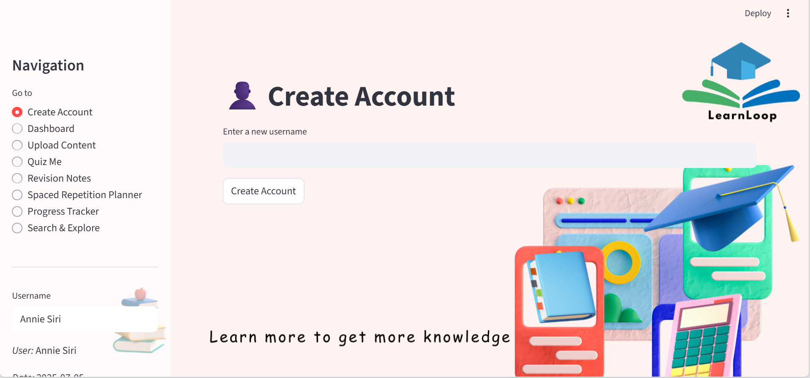
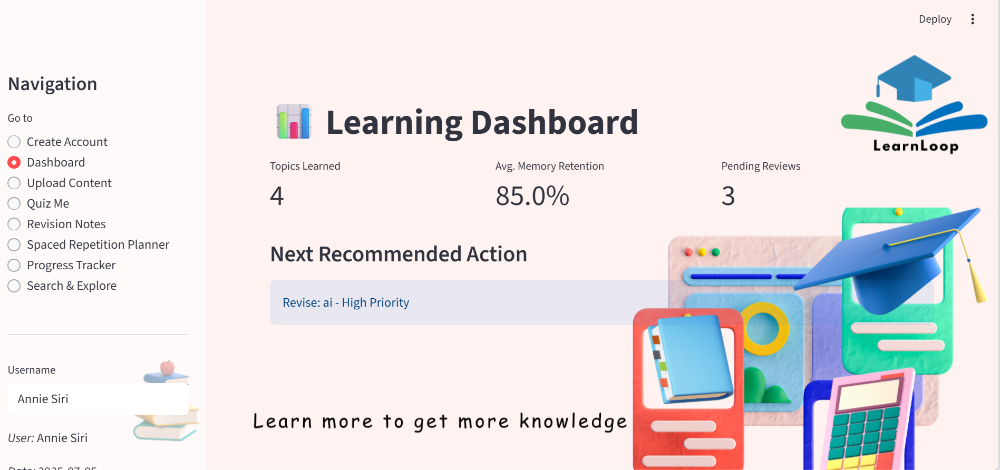
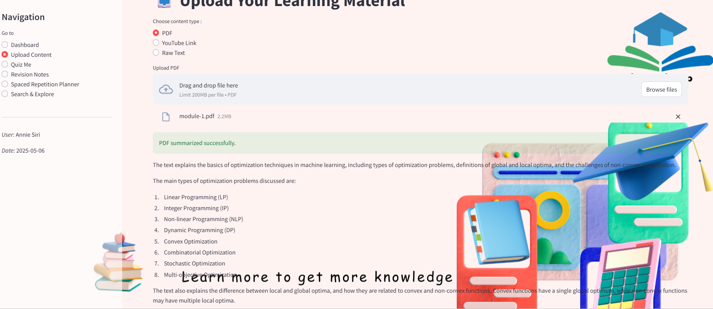
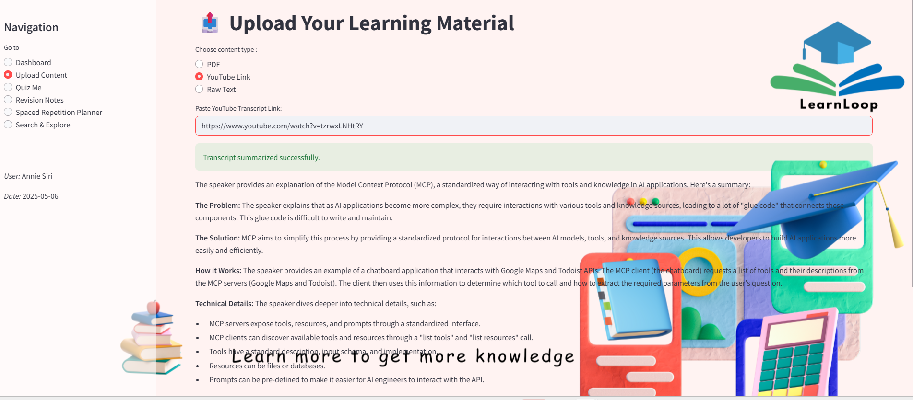
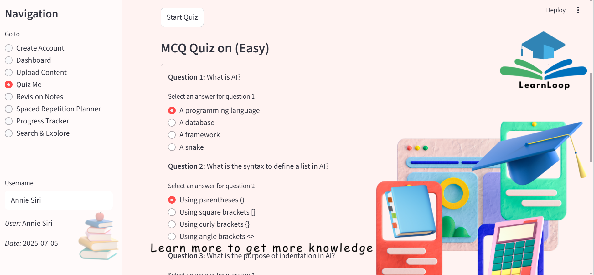
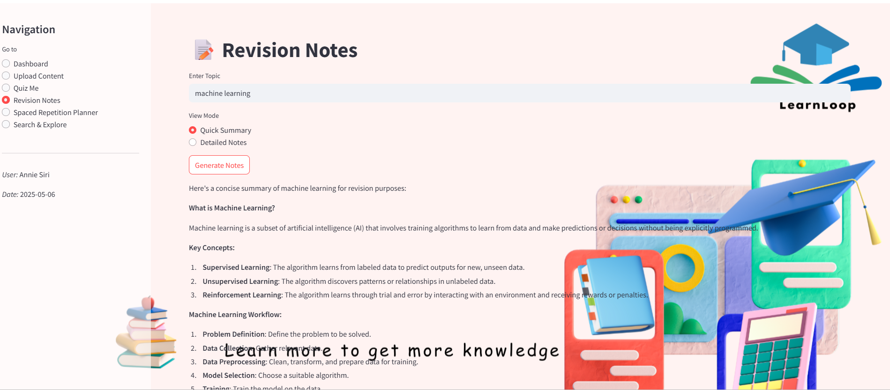
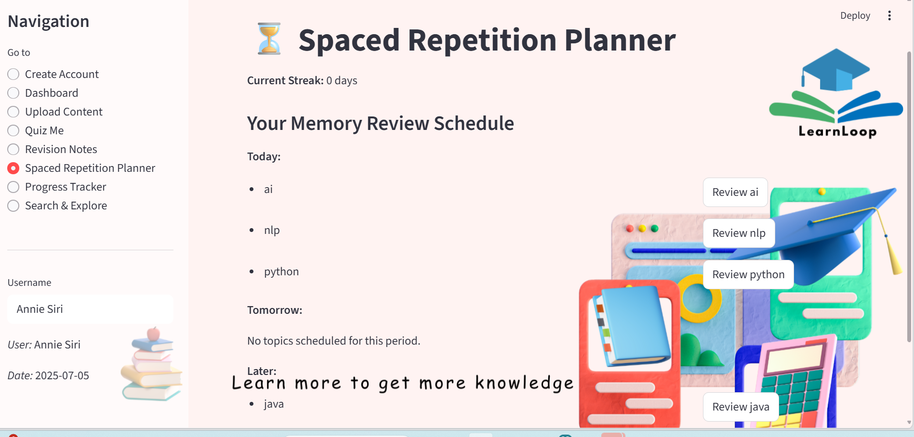
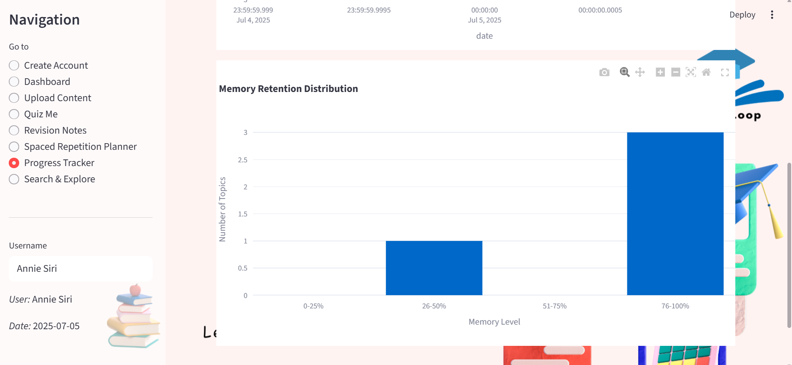
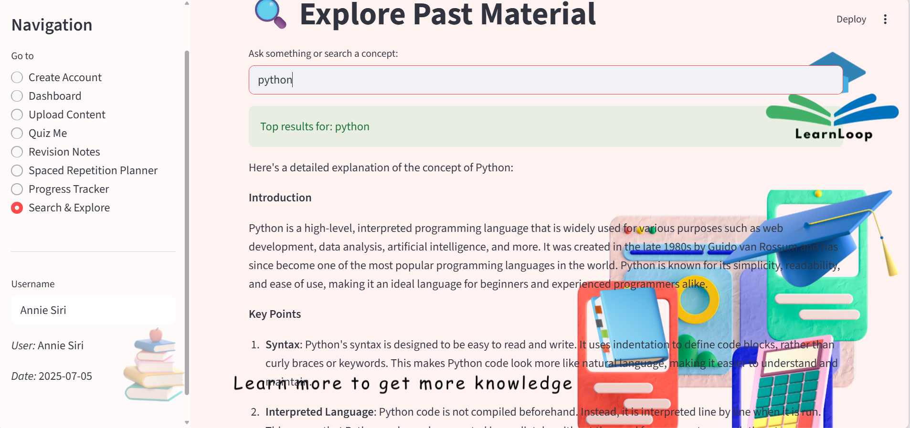

markdown
# 📚 Personalized Learning Coach

A web-based application built with **Streamlit** and powered by **Groq AI**, designed to enhance learning through personalized quizzes, revision notes, spaced repetition, and content summarization.

The app supports uploading learning materials (PDFs, YouTube links, or raw text), tracking progress, and exploring concepts — ideal for students and lifelong learners.

---

## 🚀 Live App

> [🌐 Access Personalized Learning Coach](https://personalized-learning-genai-ftdujvmnmtevwcdjk8gcky.streamlit.app/)  

---

## ✨ Features

### 👤 Create Account
- Users can create unique accounts to store personalized learning data and track their review schedules.



---

### 📊 Dashboard
- Displays key metrics:  
  - Total topics learned  
  - Average memory retention  
  - Pending reviews  



---

### 📤 Upload Content
Supports three types of learning material:

- **📄 PDF**: Extracts and summarizes content.
- **🎥 YouTube**: Fetches transcripts and summarizes videos.
- **📝 Raw Text**: Summarizes pasted notes.

Users can add these summaries to their spaced repetition review list.

  
  
<!--  -->

---

### 🧠 Quiz Me
- Generates personalized quizzes on user-defined topics with adjustable:
  - Difficulty: Easy / Medium / Hard  
  - Type: MCQ / Fill in the Blanks / Short Answer  
- Tracks answers and updates memory level.



---

### 📝 Revision Notes
- Creates quick or detailed AI-generated revision notes for any topic.
- Users can download the notes as a formatted PDF.



---

### ⏳ Spaced Repetition Planner
- Suggests reviews based on spaced repetition logic (Today / Tomorrow / Later).
- Tracks your daily learning streak.



---

### 📈 Progress Tracker
- Visualizes:
  - Topics learned over time (line chart)
  - Memory retention distribution (bar chart)



---

### 🔍 Search & Explore
- Users can ask questions or search concepts.
- Powered by Groq AI to return rich explanations or summaries.



---

## ⚙ Getting Started

### ✅ Prerequisites

- Python 3.8+
- Git
- Groq API key
- (Optional) Streamlit Community Cloud account for deployment

---

### 📦 Installation

bash
git clone https://github.com/annie-2314/Personalized-Learning-GenAI.git
cd Personalized-Learning-GenAI
```

```bash
pip install -r requirements.txt
```

```bash
# Set your Groq API Key
echo "GROQ_API_KEY=your-api-key-here" > .env
```

```bash
# Run the app
streamlit run app.py


---

## ☁ Deployment (Streamlit Cloud)

1. Push your code to GitHub:

bash
git add .
git commit -m "Initial commit"
git push origin main


2. Go to [Streamlit Cloud](https://streamlit.io/cloud):

- Connect your GitHub repo  
- Set `app.py` as the main file  
- Add your **GROQ_API_KEY** in **Secrets**  
- Deploy

---

## 📚 Dependencies

Listed in `requirements.txt`:


streamlit==1.39.0
python-dotenv==1.0.1
groq==0.11.0
PyMuPDF==1.24.10
youtube_transcript_api==0.6.2
fpdf==1.7.2
plotly==5.24.1
pandas==2.2.3
langchain==0.3.3
langchain-text-splitters==0.3.0
httpx==0.23.0


---

## 🤝 Contributing

We welcome contributions!  
To contribute:

1. Fork the repo  
2. Create a new feature branch  
3. Submit a pull request

---

## 📂 Folder Structure


.
├── app.py
├── assets/
│   ├── create_account.png
│   ├── dashboard.png
│   ├── upload_pdf.png
│   ├── upload_youtube.png
│   ├── upload_text.png
│   ├── quiz_generator.png
│   ├── revision_notes.png
│   ├── spaced_repetition.png
│   ├── progress_tracker.png
│   └── search_explore.png
├── app/
│   ├── services/
│   │   ├── pdf_processor.py
│   │   ├── youtube_processor.py
│   │   ├── quiz_generator.py
│   │   ├── revision_notes.py
│   │   └── search_concept.py
│   └── utils/
│       └── database.py
├── data/
│   └── database.db
├── requirements.txt
└── .env


---
